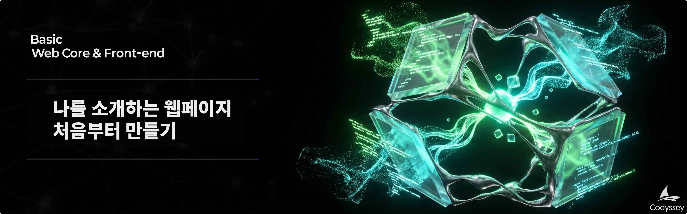

# B4-1: 나를 소개하는 웹페이지 처음부터 만들기

## 📋 과제 정보

| 항목 | 내용 |
|------|------|
| **과목** | 웹 기초와 프론트엔드 (Web Core & Front-end) |
| **난이도** | ★☆☆ (Lv.1) |
| **학습 시간** | 80분 |
| **필수 여부** | ✅ 필수 |
| **진행 상태** | 진행중 |
| **과제 번호** | 185010 |

---

## 🎯 미션 설명



---

## 🛠️ 개발 환경

### 6\. 개발 환경

*   React, Vue, jQuery, Bootstrap, Tailwind CSS 등 외부 라이브러리 사용 금지
*   순수 HTML, CSS, JavaScript만 사용
*   아이콘(Font Awesome), 웹 폰트(Google Fonts)는 허용

---

## ⚠️ 제약 사항

### 7\. 제약 사항

*   핵심 목표:
    *   UI 고퀄리티보다 "이벤트 → 상태 → 렌더링" 흐름 이해 우선
    *   React 학습 전 필수 개념(DOM 조작, 이벤트, 비동기)을 체득하는 것이 목적
*   코드 스타일:
    *   `var` 대신 `const`, `let` 사용
    *   HTML에 `onclick` 대신 `addEventListener` 사용
    *   인라인 스타일(`style="..."`) 사용 금지
*   브라우저:
    *   최신 Chrome 브라우저에서 정상 동작
*   제출물:
    *   GitHub 저장소 URL
    *   배포된 사이트 URL (GitHub Pages)
    *   데스크톱/모바일/다크모드 스크린샷
*   GitHub API 주의사항:
    *   인증 없이 호출 시 시간당 60회 제한(레이트 리밋)이 있으므로, 짧은 시간 내 반복 새로고침을 피한다.
    *   레이트 리밋 발생 시(403 응답) 에러 상태 UI가 표시되도록 처리한다.

---

## 📝 결과 예시

### 8\. 결과 예시

아래는 정답이 아니라 참고 예시다. 디자인은 본인의 개성에 맞게 자유롭게 구성한다.

\[데스크톱 화면\]

```css
+------------------------------------------------------------------+
| Logo                           Menu                         [D]  |  <- Header (Flex)
+------------------------------------------------------------------+
|                                                                  |
|                          Hello!                                  |
|                       I am [NAME].                               |  <- Hero
|                                                                  |
|                 [ View Projects ]   [ Contact ]                  |
|                                                                  |
+------------------------------------------------------------------+
| About Me                                                         |
|  +----------+  Intro text...                                     |
|  |  PHOTO   |  (skills / interests / short bio)                  |  <- About
|  +----------+                                                    |
+------------------------------------------------------------------+
| Projects (GitHub API)                                            |
|                                                                  |
|  +--------------+  +--------------+  +--------------+            |
|  | Repo 1        |  | Repo 2     |  | Repo 3        |            |
|  | Stars: 5      |  | Stars: 3   |  | Stars: 2      |            |
|  +--------------+  +--------------+  +--------------+            |
|                                                                  |
+------------------------------------------------------------------+
| Contact                                                          |
|  +------------------------------------------------------------+  |
|  | Name:    [____________________]                            |  |
|  | Email:   [____________________]                            |  |
|  | Message: [______________________________]                  |  |
|  |                          [ Send ]                          |  |
|  +------------------------------------------------------------+  |
+------------------------------------------------------------------+
| (C) 2026 [NAME]   |  GitHub  |  LinkedIn                         |
+------------------------------------------------------------------+
```

\[상태별 UI 예시\]

*   로딩 중: Projects 섹션에 스피너가 보인다.
*   성공: 카드 리스트가 보인다.
*   에러: "프로젝트를 불러올 수 없습니다. \[다시 시도\]" 버튼이 보인다.
*   빈 데이터: "표시할 프로젝트가 없습니다."가 보인다.

---

## 📊 평가 정보

- 평가 대상: 예

---

> *이 문서는 Codyssey AI/SW 기초 과정의 과제 내용을 기반으로 자동 생성되었습니다.*
