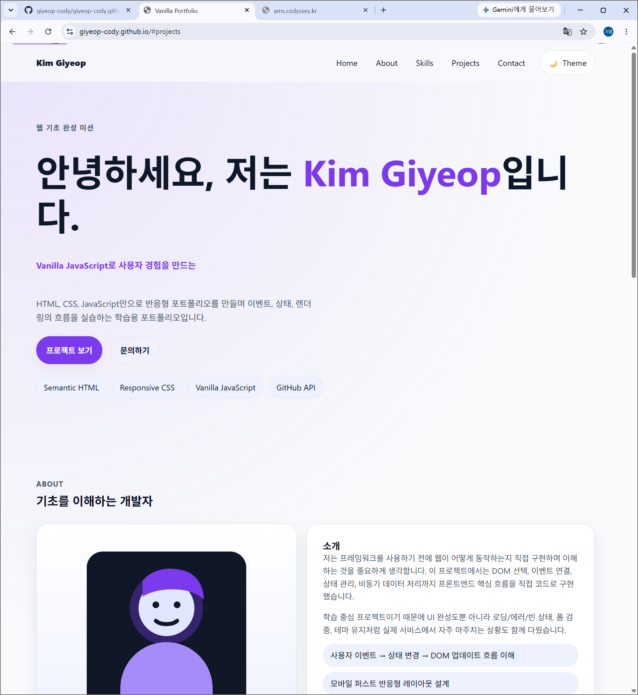
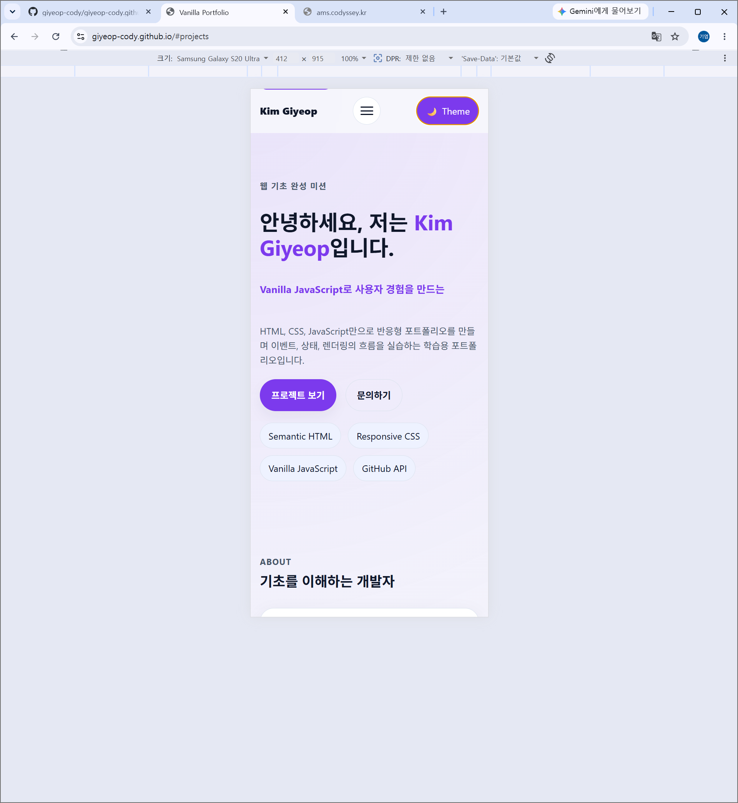
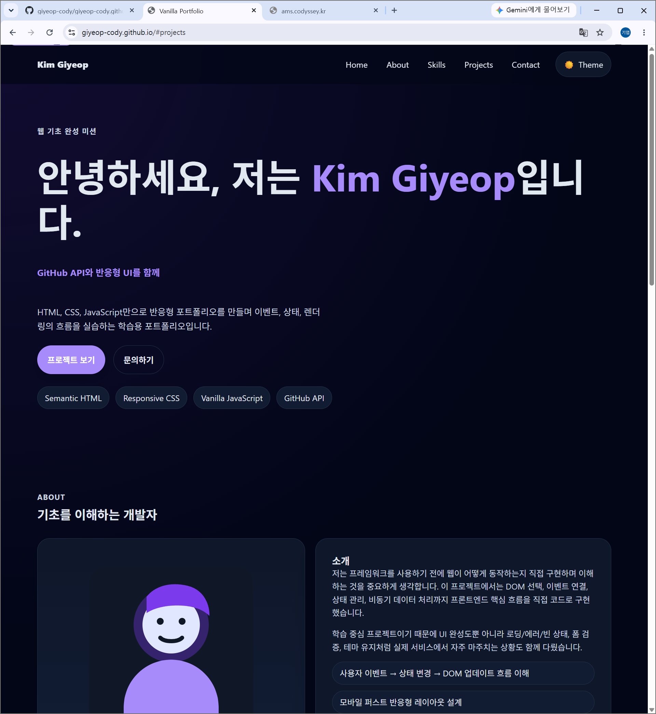

# Vanilla Portfolio Mission

순수 **HTML / CSS / JavaScript**만으로 구현한 반응형 포트폴리오 웹사이트입니다.  
이 프로젝트는 `portfolio-mission.md`를 기준으로 제작되었으며, **사용자 이벤트 → 상태 변경 → DOM 업데이트** 흐름을 직접 구현하는 것을 목표로 합니다.

> 현재 이 README는 **최종 제출용 형태로 정리**되어 있으며, 아래 placeholder 값만 실제 정보로 교체하면 바로 제출 문서로 사용할 수 있습니다.

---

## 1. 프로젝트 개요

이 프로젝트는 HTML, CSS, JavaScript의 기초를 바탕으로 다음 내용을 직접 구현하는 학습용 포트폴리오입니다.

- 시맨틱 HTML 구조 설계
- CSS 변수, Flexbox, Grid 기반 반응형 UI
- DOM 선택과 이벤트 처리
- 다크 모드와 `localStorage`를 활용한 상태 유지
- `fetch`, `async/await`, `try/catch` 기반 GitHub API 연동
- 로딩 / 성공 / 에러 / 빈 상태 처리
- 폼 유효성 검사와 상태 기반 렌더링

현재 GitHub API 연동에는 **GitHub 계정 `giyeop-cody`** 가 사용됩니다.

---

## 2. 프로젝트 설명

이 포트폴리오는 단순히 정적인 화면을 만드는 것이 아니라, 아래 흐름을 직접 코드로 구현하는 데 집중했습니다.

- 사용자가 버튼을 클릭한다.
- 이벤트가 발생한다.
- 상태가 변경된다.
- 변경된 상태에 따라 DOM이 업데이트된다.
- 화면이 달라진다.

즉, React 학습 이전에 반드시 이해해야 하는 **웹의 기본 동작 원리**를 순수 JavaScript로 직접 구현한 결과물입니다.

---

## 3. 사용 기술

- HTML5
- CSS3
- Vanilla JavaScript (ES6+)
- GitHub REST API
- localStorage
- Intersection Observer

---

## 4. 주요 기능

### 필수 기능
- 반응형 레이아웃
- Hero / About / Skills / Projects / Contact / Footer 섹션
- 햄버거 메뉴
- 부드러운 스크롤
- 스크롤 탑 버튼
- 스크롤 시 네비게이션 스타일 변경
- 다크 모드 토글 및 상태 유지
- Contact 폼 유효성 검사
- GitHub API 프로젝트 렌더링
- 로딩 / 성공 / 에러 / 빈 상태 UI
- 재시도 버튼

### 보너스 기능
- 프로젝트 언어 필터링
- Hero 타이핑 효과
- 시스템 다크 모드 감지(`prefers-color-scheme`)

---

## 5. 상태 관리 흐름

이 프로젝트는 아래 상태 기반 렌더링 흐름을 구현합니다.

1. **다크 모드 토글**
   - 사용자 클릭 → `theme` 상태 변경 → `data-theme` 갱신 → 전체 화면 테마 변경

2. **GitHub API 상태 처리**
   - API 호출 → `status`가 `loading/success/error/empty`로 변경 → Projects 섹션 UI 갱신

3. **폼 유효성 검사**
   - 사용자 입력 → 필드별 검증 상태 변경 → 에러 메시지 표시/숨김

4. **프로젝트 필터 상태**
   - 필터 버튼 클릭 → `activeFilter` 변경 → 목록 재필터링 및 재렌더링

---

## 6. 기준값

- 스크롤 탑 버튼 표시 기준: **300px**
- 네비게이션 스타일 변경 기준: **60px**
- `Intersection Observer` threshold: **0.25**

---

## 7. 폴더 구조

```text
.
├─ index.html
├─ css/
│  └─ style.css
├─ js/
│  └─ main.js
├─ images/
│  └─ profile.svg
├─ README.md
├─ validate-portfolio.mjs
├─ portfolio-mission.md
├─ portfolio-learning-goals.md
├─ portfolio-evidence-checklist.md
├─ portfolio-requirements.md
├─ portfolio-final-deliverables.md
├─ portfolio-constraints.md
├─ portfolio-plan.md
├─ portfolio-tasks.md
├─ portfolio-deployment-checklist.md
└─ github-pages-deployment-guide.md
```

---

## 8. 실행 방법

### 로컬 실행
- VS Code에서 프로젝트 폴더를 연다.
- Live Server로 `index.html`을 실행한다.

### 자동 검증 실행

```bash
node validate-portfolio.mjs
```

---

## 9. 검증 결과

자동 검증 결과:

- total: 41
- passed: 41
- failed: 0

추가 스모크 테스트:
- GitHub API `giyeop-cody` 엔드포인트 응답: **200 OK**
- 로컬 정적 서버 기준 `index.html` 핵심 섹션/폼 구조 확인 완료

즉, **문서 기준 핵심 구현 항목은 모두 통과**했습니다.

---

## 10. 저장소 및 배포 정보

- GitHub 저장소 URL: `https://github.com/giyeop-cody/B4-1`
- GitHub Pages 배포 URL: `https://giyeop-cody.github.io`

> 배포 후 위 두 항목을 실제 값으로 교체하세요.

---

## 11. 스크린샷

> 아래는 최종 제출용 형식입니다. 실제 캡처 파일을 준비한 뒤 경로를 맞춰 넣으면 됩니다.

### 데스크톱


### 모바일


### 다크 모드


> 현재 작업 환경에는 브라우저 캡처 기능이 없어 실제 스크린샷 파일은 아직 포함되지 않았습니다.  
> 배포 후 `screenshots/desktop.png`, `screenshots/mobile.png`, `screenshots/dark-mode.png` 파일을 추가하세요.

---

## 12. 실제 적용 값

현재 문서와 프로젝트에는 아래 값이 반영되어 있습니다.

- 이름: `Kim Giyeop`
- GitHub 사용자명: `giyeop-cody`
- GitHub 링크: `https://github.com/giyeop-cody`
- LinkedIn 링크: 사용 안 함
- 이메일: `cody.giyeop@gmail.com`
- GitHub 저장소 URL: `https://github.com/giyeop-cody/giyeop-cody.github.io`
- GitHub Pages 배포 URL: `https://giyeop-cody.github.io`

---

## 13. 배포 절차 문서

배포 전/후 작업은 아래 문서를 참고하세요.

- 배포 전 점검표: `portfolio-deployment-checklist.md`
- GitHub 업로드 / GitHub Pages 배포 절차: `github-pages-deployment-guide.md`
- 필수 증거 문서: `portfolio-evidence-checklist.md`

---

## 14. 최종 제출 체크

최종 제출 시 아래 항목을 포함하세요.

- GitHub 저장소 URL
- GitHub Pages 배포 URL
- 데스크톱 스크린샷
- 모바일 스크린샷
- 다크 모드 스크린샷

---

## 15. 비고

- 외부 UI 라이브러리는 사용하지 않았습니다.
- 아이콘 라이브러리 없이도 미션 요구사항을 충족하도록 구현했습니다.
- 실제 제출 전에는 자신의 정보와 링크로 교체하는 것이 좋습니다.
